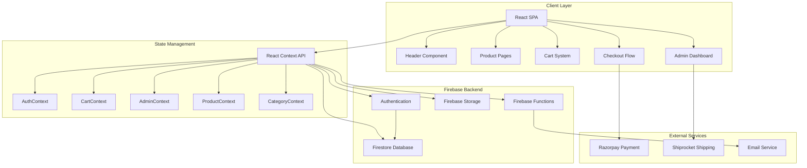
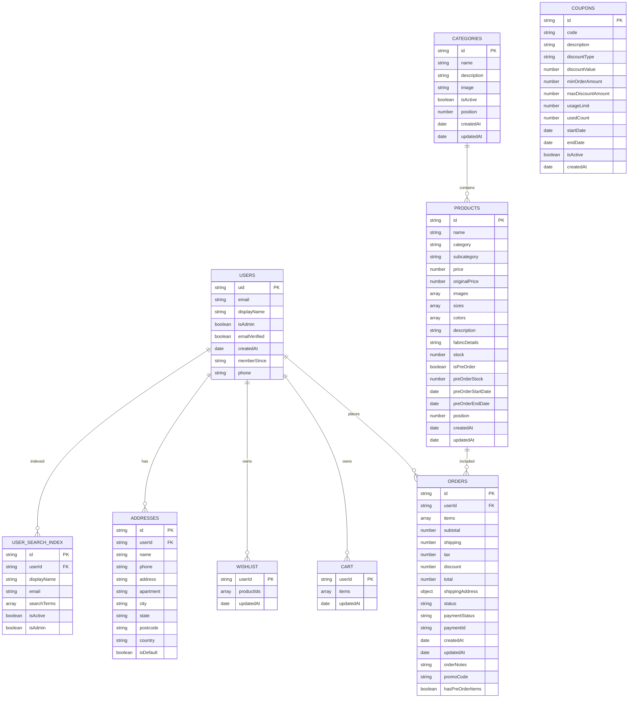
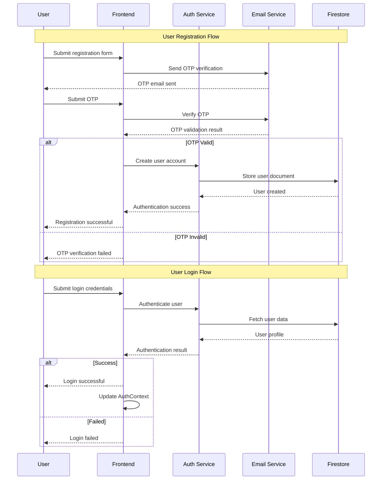
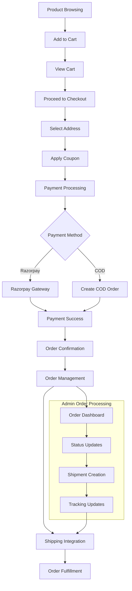
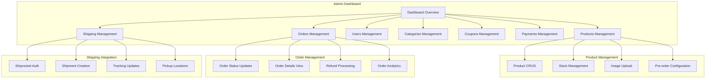

# HaathSaga E-Commerce Platform
## High-Level Design (HLD) Documentation

---

### Table of Contents
1. [System Overview](#overview)
2. [System Architecture](#architecture)
3. [Data Architecture](#data-architecture)
4. [Authentication Flow](#authentication)
5. [E-Commerce Flow](#ecommerce-flow)
6. [Admin System Architecture](#admin-system)
7. [Technical Decisions](#technical-decisions)
8. [Scalability Considerations](#scalability)
9. [Security Considerations](#security)

---

## 1. System Overview

HaathSaga is a modern e-commerce platform built with React and Firebase, specializing in fashion apparel. The platform provides a complete shopping experience from product browsing to order management, with robust admin capabilities and third-party integrations.

### Technology Stack
- **React 19.2.0** - Frontend framework
- **Firebase 12.5.0** - Backend services
- **Vite 6.2.0** - Build tool and development server
- **Tailwind CSS** - Styling framework
- **Razorpay** - Payment gateway
- **Shiprocket** - Shipping and logistics
- **React Router** - Client-side routing

---

## 2. System Architecture

### Frontend Architecture
The frontend is built as a Single Page Application (SPA) using React 19.2.0 with component-based architecture. Key components include:

- **Product Catalog:** Dynamic product browsing with filtering and search
- **Shopping Cart:** Real-time cart management with localStorage persistence
- **Checkout System:** Multi-step checkout with address management and payment integration
- **Admin Dashboard:** Comprehensive admin interface for product, order, and user management

### Backend Architecture
Firebase provides a serverless backend with:

- **Firebase Authentication:** User authentication with email/password and OTP verification
- **Firestore:** NoSQL database for real-time data synchronization
- **Firebase Storage:** Cloud storage for product images and assets
- **Firebase Functions:** Server-side logic for email notifications and order processing

### System Architecture Diagram

### Architectural Decision
The system uses a serverless architecture with Firebase to minimize infrastructure management while providing scalability and real-time capabilities. React Context API is chosen over Redux for simpler state management given the application's current complexity.

---

## 3. Data Architecture

### Database Design Principles
- **Denormalization:** Product data includes category names for faster queries
- **Composite Documents:** Orders contain complete item snapshots to preserve historical data
- **Search Optimization:** User search index enables efficient admin user searches
- **Real-time Updates:** Cart and wishlist data syncs across user sessions

### Firestore Collections Structure

### Database Indexing Strategy

| Collection | Primary Purpose | Key Fields | Indexing Strategy |
|------------|----------------|-------------|-------------------|
| users | User authentication and profiles | uid, email, isAdmin, emailVerified | Composite on (userId, createdAt) |
| products | Product catalog | category, stock, isPreOrder, position | Composite on (isPreOrder, preOrderStock) |
| orders | Order management | userId, status, createdAt | Composite on (userId, createdAt DESC) |
| userSearchIndex | Admin user search | searchTerms, isActive, isAdmin | Array-contains on searchTerms |

---

## 4. Authentication Flow

### Authentication Features
- **Email/Password Authentication:** Traditional login with Firebase Auth
- **OTP Verification:** Email-based OTP for account verification
- **Role-Based Access:** Admin vs regular user permissions
- **Session Management:** Persistent authentication with token refresh
- **Rate Limiting:** Protection against brute force attacks

### Authentication Flow Diagram

### Security Implementation
Admin access is granted to specific email addresses (haathsaga.mauryas19@gmail.com, admin@haathsaga.com) with fallback database verification for other admin users.

---

## 5. E-Commerce Flow

### Shopping Cart Features
- **Real-time Updates:** Cart syncs across devices via Firebase
- **Guest Cart:** Local storage for non-authenticated users
- **Product Variants:** Support for size and color selection
- **Stock Validation:** Real-time stock checking
- **Pre-order Support:** Mixed cart with regular and pre-order items

### Payment Processing
- **Razorpay Integration:** Multiple payment methods (UPI, Cards, Net Banking)
- **Cash on Delivery:** COD option for eligible orders
- **Payment Security:** PCI compliance through Razorpay
- **Order Creation:** Orders created before payment processing
- **Failure Handling:** Automatic order cancellation on payment failure

### Order Management
- **Order Status Tracking:** Processing → Shipped → Delivered
- **Stock Management:** Automatic stock updates on order placement
- **Pre-order Handling:** Separate stock tracking for pre-orders
- **Cancellation Support:** Order cancellation with stock restoration
- **Shipping Integration:** Shiprocket API for shipment management

### E-Commerce Flow Diagram

---

## 6. Admin System Architecture

### Admin Features
- **Dashboard Analytics:** Real-time statistics and KPIs
- **Product Management:** Full CRUD with image upload and stock control
- **Order Processing:** Status updates, refunds, and tracking
- **User Management:** User roles and account administration
- **Category Management:** Hierarchical product categorization
- **Coupon System:** Discount code creation and management
- **Shipping Integration:** Shiprocket API integration

### Admin System Architecture Diagram

### Permission System
Admin access is restricted to specific email addresses with additional database-based role verification. The system supports role-based access control with potential for future expansion.

---

## 7. Technical Decisions

### Frontend Technology Stack
- **React 19.2.0:** Latest React version with improved performance and features
- **Vite:** Fast development server and optimized builds
- **Tailwind CSS:** Utility-first CSS for rapid UI development
- **React Router:** Client-side routing for SPA experience

### Backend Technology Stack
- **Firebase:** Serverless backend with real-time capabilities
- **Firestore:** NoSQL database for flexible data structure
- **Firebase Authentication:** Secure user authentication
- **Firebase Storage:** Scalable file storage

### Third-Party Integrations
- **Razorpay:** Payment gateway with multiple payment options
- **Shiprocket:** Shipping and logistics management
- **Nodemailer:** Email service for notifications

### Architecture Philosophy
The system prioritizes developer productivity, scalability, and maintainability through modern web technologies and serverless architecture. Firebase was chosen to minimize infrastructure overhead while providing enterprise-grade features.

---

## 8. Scalability Considerations

### Database Scalability
- **Firestore Indexing:** Optimized queries for large datasets
- **Data Pagination:** Server-side pagination for large collections
- **Caching Strategy:** Client-side caching for frequently accessed data
- **Real-time Limits:** Efficient real-time listener management

### Application Scalability
- **Component Lazy Loading:** Code splitting for better performance
- **Image Optimization:** Responsive images and lazy loading
- **State Management:** Efficient state updates and subscriptions
- **Error Boundaries:** Graceful error handling and recovery

### Infrastructure Scalability
- **Firebase Auto-scaling:** Automatic scaling based on demand
- **CDN Distribution:** Global content delivery network
- **Serverless Functions:** Event-driven scaling for backend processes
- **Storage Optimization:** Efficient file storage and retrieval

---

## 9. Security Considerations

### Authentication Security
- **OTP Verification:** Email-based verification for account security
- **Rate Limiting:** Protection against brute force attacks
- **Session Management:** Secure token handling and refresh
- **Password Security:** Firebase's built-in password security

### Data Security
- **Firestore Rules:** Database access control and validation
- **Input Validation:** Client and server-side validation
- **Sensitive Data:** Proper handling of user information
- **Audit Logging:** Tracking of admin actions and changes

### Payment Security
- **PCI Compliance:** Razorpay handles payment security
- **Secure Checkout:** HTTPS and secure payment flow
- **Fraud Prevention:** Basic fraud detection measures
- **Refund Security:** Controlled refund processing

### Security Best Practices
The system follows industry-standard security practices including secure authentication, data encryption, access control, and regular security updates through Firebase and third-party services.

---

## Conclusion

HaathSaga's architecture is designed to provide a robust, scalable, and maintainable e-commerce platform. The combination of modern frontend technologies with Firebase's serverless backend creates an efficient development and deployment workflow while ensuring excellent user experience and system reliability.

---

**Document Version:** 1.0  
**Last Updated:** January 2025  
**Author:** Architecture Team