# HaathSaga E-Commerce Platform
## Low-Level Design (LLD) Documentation

---

### Table of Contents
1. [Implementation Overview](#overview)
2. [Component Architecture](#component-architecture)
3. [Service Layer Architecture](#service-layer)
4. [Database Schema Design](#database-schema)
5. [State Management Flow](#state-management)
6. [Security Implementation](#security-implementation)
7. [API Integration Patterns](#api-integration)
8. [Caching Strategy](#caching-strategy)
9. [Error Handling Strategy](#error-handling)

---

## 1. Implementation Overview

This Low-Level Design (LLD) document provides detailed implementation specifications for the HaathSaga e-commerce platform. It covers component architecture, service implementations, database design, state management patterns, and security mechanisms.

### Technology Stack
- **React 19.2.0** - Frontend framework
- **Firebase 12.5.0** - Backend services
- **Vite 6.2.0** - Build tool and development server
- **Tailwind CSS** - Styling framework
- **Razorpay** - Payment gateway
- **Shiprocket** - Shipping and logistics
- **React Router** - Client-side routing
- **Context API** - State management

### Implementation Philosophy
The system follows a component-based architecture with clear separation of concerns. Firebase provides the backend infrastructure while React handles the frontend with Context API for state management. All services are modular and follow dependency injection patterns.

---

## 2. Component Architecture

### Component Hierarchy

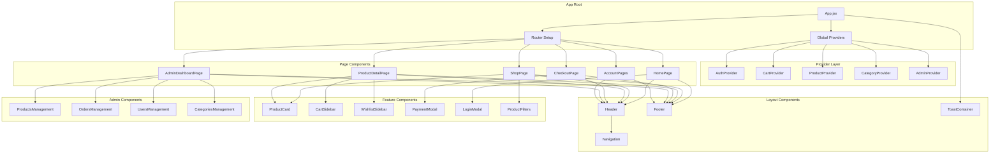

### Component Hierarchy Details
- **App.jsx:** Root component that initializes routing and global providers
- **Provider Layer:** Context providers that manage global state and services
- **Layout Components:** Reusable UI components that provide structure
- **Page Components:** Top-level components for each route
- **Feature Components:** Reusable components for specific functionality
- **Admin Components:** Specialized components for administrative functions

### Props Flow Pattern

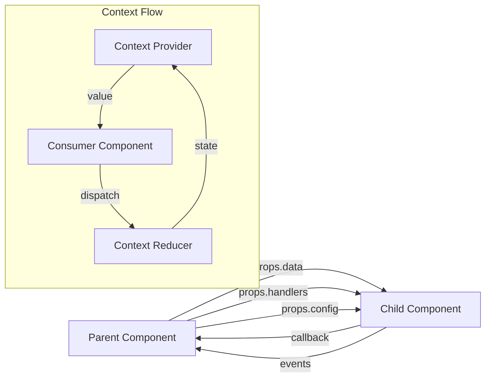

### Component Implementation Patterns

```javascript
// Component with Context and Props Pattern
const ProductCard = ({ product, onAddToCart, onWishlist }) => {
  const { cart, addToCart } = useCart();
  const { wishlist, toggleWishlist } = useWishlist();
  const { user } = useAuth();
  
  const handleAddToCart = () => {
    addToCart(product);
    onAddToCart?.(product);
  };
  
  const handleWishlist = () => {
    toggleWishlist(product);
    onWishlist?.(product);
  };
  
  return (
    <div className="product-card">
      
      <h3>{product.name}</h3>
      <p>₹{product.price}</p>
      <button onClick={handleAddToCart}>Add to Cart</button>
      <button onClick={handleWishlist}>
        {wishlist.some(item => item.id === product.id) ? '❤️' : '🤍'}
      </button>
    </div>
  );
};
```

---

## 3. Service Layer Architecture

### Service Architecture Diagram

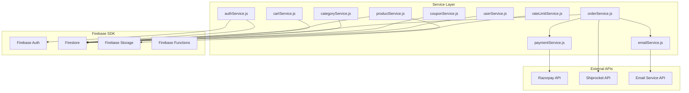

### Service Layer Responsibilities
- **authService.js:** User authentication, registration, password management
- **productService.js:** Product CRUD operations, stock management, image handling
- **cartService.js:** Cart operations, stock validation, wishlist management
- **orderService.js:** Order processing, status tracking, payment integration
- **categoryService.js:** Category management, hierarchical organization
- **couponService.js:** Discount code validation and application
- **userService.js:** User profile management, search indexing
- **paymentService.js:** Payment processing, Razorpay integration
- **emailService.js:** Email notifications, OTP verification
- **rateLimitService.js:** API rate limiting, abuse prevention

### Service Implementation Pattern

```javascript
// Service with Error Handling and Rate Limiting
export const createProduct = async (productData, imageFiles) => {
  try {
    // Validate input
    if (!productData.name || !productData.price) {
      throw new Error('Product name and price are required');
    }
    
    // Handle image uploads
    const imageUrls = [];
    if (imageFiles && imageFiles.length > 0) {
      for (const file of imageFiles) {
        const storageRef = ref(storage, `products/${Date.now()}_${file.name}`);
        await uploadBytes(storageRef, file);
        const downloadUrl = await getDownloadURL(storageRef);
        imageUrls.push(downloadUrl);
      }
    }
    
    // Create product document
    const productsRef = collection(db, 'products');
    const newProduct = {
      ...productData,
      images: imageUrls,
      createdAt: new Date(),
      updatedAt: new Date()
    };
    
    const docRef = await addDoc(productsRef, newProduct);
    return { id: docRef.id, ...newProduct };
  } catch (error) {
    console.error('Error creating product:', error);
    throw new Error(`Failed to create product: ${error.message}`);
  }
};
```

### Error Handling Strategy

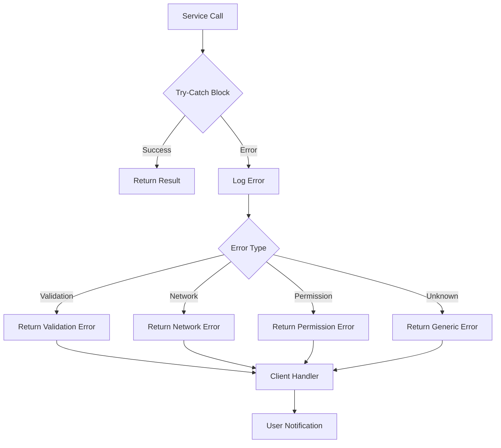

---

## 4. Database Schema Design

### Database Schema Diagram

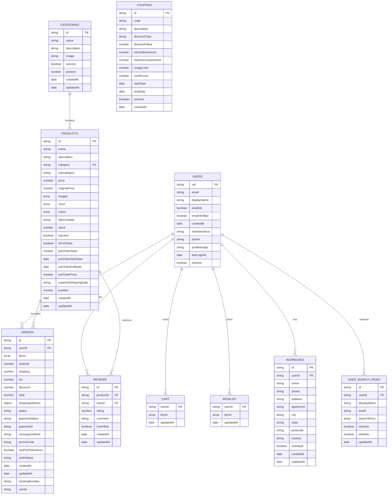

### Detailed Field Definitions

#### Products Collection
| Field | Type | Description | Validation |
|-------|------|-------------|------------|
| id | string | Unique product identifier | Auto-generated |
| name | string | Product name | Required, max 100 chars |
| price | number | Current selling price | Required, >= 0 |
| stock | number | Available inventory | Required, >= 0 |
| isPreOrder | boolean | Pre-order availability flag | Default: false |
| preOrderStock | number | Pre-order inventory | Required if isPreOrder=true |

#### Orders Collection
| Field | Type | Description | Validation |
|-------|------|-------------|------------|
| items | array | Order items with snapshots | Required, non-empty |
| status | string | Order status | Enum: pending, processing, shipped, delivered, cancelled |
| paymentStatus | string | Payment status | Enum: pending, paid, failed, refunded |
| hasPreOrderItems | boolean | Contains pre-order items | Auto-calculated |

### Indexing Strategy

```javascript
// Firestore Indexes Configuration
{
  "indexes": [
    {
      "collectionGroup": "orders",
      "queryScope": "COLLECTION",
      "fields": [
        { "fieldPath": "userId", "order": "ASCENDING" },
        { "fieldPath": "createdAt", "order": "DESCENDING" }
      ]
    },
    {
      "collectionGroup": "products",
      "queryScope": "COLLECTION",
      "fields": [
        { "fieldPath": "isPreOrder", "order": "ASCENDING" },
        { "fieldPath": "preOrderStock", "order": "ASCENDING" }
      ]
    },
    {
      "collectionGroup": "userSearchIndex",
      "queryScope": "COLLECTION",
      "fields": [
        { "fieldPath": "searchTerms", "arrayConfig": "CONTAINS" },
        { "fieldPath": "isActive", "order": "ASCENDING" }
      ]
    }
  ]
}
```

### Security Rules Implementation

```javascript
// Firestore Security Rules
rules_version = '2';
service cloud.firestore {
  match /databases/{database}/documents {
    function isAdmin() {
      return request.auth != null && (
        request.auth.token.email == 'admin@haathsaga.com' ||
        request.auth.token.email == 'haathsaga.mauryas19@gmail.com'
      );
    }
    
    match /products/{documentId} {
      allow read: if true;
      allow write: if isAdmin();
    }
    
    match /orders/{documentId} {
      allow read: if isAdmin() || (request.auth != null && 
        request.auth.uid == resource.data.userId);
      allow create: if request.auth != null && 
        request.auth.uid == request.resource.data.userId;
      allow update: if isAdmin() || (request.auth != null && 
        request.auth.uid == resource.data.userId);
    }
  }
}
```

---

## 5. State Management Flow

### State Management Architecture

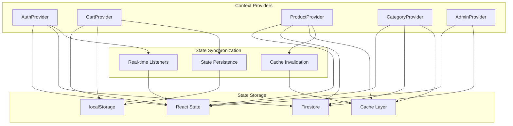

### Context Implementation Details

#### AuthContext
- **State:** user, userData, isLoading
- **Actions:** signIn, signOut, updateProfile
- **Persistence:** Firebase Auth session
- **Real-time:** onAuthStateChanged listener

#### CartContext
- **State:** cart items, total, count
- **Actions:** addToCart, removeFromCart, updateQuantity
- **Persistence:** localStorage + Firestore
- **Sync:** Guest to authenticated user migration

#### ProductContext
- **State:** products list, loading, error
- **Actions:** fetchProducts, search, filter
- **Caching:** 5-minute cache with invalidation
- **Optimization:** Batch fetching, lazy loading

### Context Implementation Pattern

```javascript
// ProductContext with Caching and Optimization
export const ProductProvider = ({ children }) => {
  const [products, setProducts] = useState([]);
  const [loading, setLoading] = useState(false);
  const [error, setError] = useState(null);
  
  const CACHE_DURATION = 5 * 60 * 1000; // 5 minutes
  
  const fetchProducts = useCallback(async (options = {}) => {
    const cacheKey = generateCacheKey(options);
    
    // Check cache first
    const cachedData = getCachedData(cacheKey);
    if (cachedData) {
      setProducts(cachedData);
      return cachedData;
    }
    
    setLoading(true);
    try {
      const productsData = await getProductsByFilters(options);
      setProducts(productsData);
      setCachedData(cacheKey, productsData);
      return productsData;
    } catch (err) {
      setError(err.message);
      return [];
    } finally {
      setLoading(false);
    }
  }, []);
  
  const invalidateCache = useCallback((options = {}) => {
    invalidateProductCache(options);
    return fetchProducts({ ...options, forceRefresh: true });
  }, [fetchProducts]);
  
  return (
    <ProductContext.Provider value={{
      products,
      loading,
      error,
      fetchProducts,
      invalidateCache
    }}>
      {children}
    </ProductContext.Provider>
  );
};
```

### Guest to User Migration Pattern

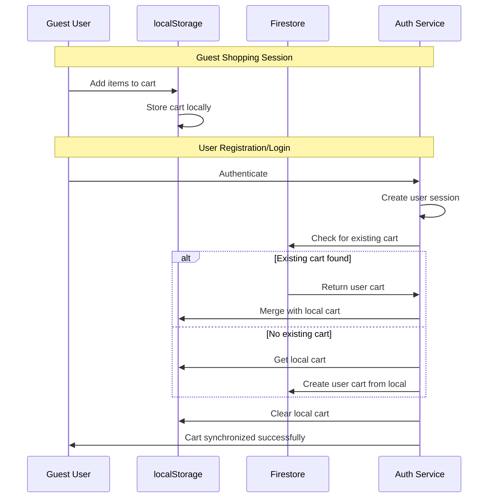

### Cache Invalidation Strategy

```javascript
// Cache Management Utilities
const cacheUtils = {
  // Generate cache key based on parameters
  generateKey: (type, params = {}) => {
    const sortedParams = Object.keys(params)
      .sort()
      .map(key => `${key}:${params[key]}`)
      .join('|');
    return `${type}:${sortedParams}`;
  },
  
  // Invalidate cache patterns
  invalidatePattern: (pattern) => {
    const keys = Object.keys(localStorage);
    keys.forEach(key => {
      if (key.includes(pattern)) {
        localStorage.removeItem(key);
      }
    });
  },
  
  // Smart cache invalidation
  invalidateRelated: (type, id) => {
    switch (type) {
      case 'product':
        cacheUtils.invalidatePattern(`products:*`);
        cacheUtils.invalidatePattern(`category:*`);
        cacheUtils.invalidatePattern(`search:*`);
        break;
      case 'category':
        cacheUtils.invalidatePattern(`products:*`);
        cacheUtils.invalidatePattern(`category:*`);
        break;
      case 'order':
        cacheUtils.invalidatePattern(`orders:${id}`);
        cacheUtils.invalidatePattern(`user:orders:*`);
        break;
    }
  }
};
```

---

## 6. Security Implementation

### Security Architecture

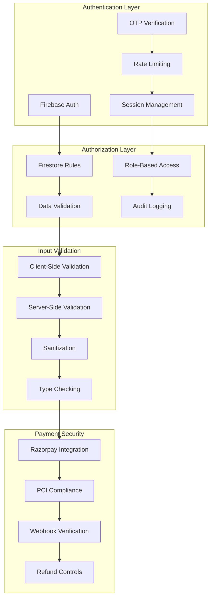

### Authentication Flow Implementation

#### Registration with OTP
1. User submits email and password
2. System generates and sends OTP via email
3. User verifies OTP within 10 minutes
4. Account created with emailVerified flag
5. User automatically logged in

#### Admin Authentication
1. Hardcoded admin emails: haathsaga.mauryas19@gmail.com, admin@haathsaga.com
2. Fallback database verification for other admin users
3. Role-based access control in Firestore rules
4. Admin action logging and audit trails

### Rate Limiting Implementation

```javascript
// Rate Limiting Service
class RateLimitService {
  static checkRateLimit(identifier, action, limit = 5, windowMs = 60000) {
    const key = `rate_limit:${identifier}:${action}`;
    const now = Date.now();
    const windowStart = now - windowMs;
    
    // Get existing attempts
    const attempts = JSON.parse(localStorage.getItem(key) || '[]');
    
    // Filter out old attempts
    const recentAttempts = attempts.filter(timestamp => timestamp > windowStart);
    
    // Check if limit exceeded
    if (recentAttempts.length >= limit) {
      const oldestAttempt = Math.min(...recentAttempts);
      const remainingTime = Math.ceil((oldestAttempt + windowMs - now) / 1000);
      
      return {
        allowed: false,
        remainingTime,
        message: `Too many attempts. Try again in ${remainingTime} seconds.`
      };
    }
    
    // Add current attempt
    recentAttempts.push(now);
    localStorage.setItem(key, JSON.stringify(recentAttempts));
    
    return { allowed: true };
  }
  
  static recordSuccess(identifier, action) {
    const key = `rate_limit:${identifier}:${action}`;
    localStorage.removeItem(key);
  }
}

// HOC for rate limiting
export const withRateLimit = (fn, action, getIdentifier) => {
  return async (...args) => {
    const identifier = getIdentifier ? getIdentifier(...args) : 'anonymous';
    const rateLimitResult = RateLimitService.checkRateLimit(identifier, action);
    
    if (!rateLimitResult.allowed) {
      const error = new Error(rateLimitResult.message);
      error.code = 'RATE_LIMIT_EXCEEDED';
      error.remainingTime = rateLimitResult.remainingTime;
      throw error;
    }
    
    try {
      const result = await fn(...args);
      RateLimitService.recordSuccess(identifier, action);
      return result;
    } catch (error) {
      throw error;
    }
  };
};
```

### Data Validation Patterns

```javascript
// Input Validation Schema
const validationSchemas = {
  product: {
    name: {
      required: true,
      type: 'string',
      minLength: 1,
      maxLength: 100,
      sanitize: true
    },
    price: {
      required: true,
      type: 'number',
      min: 0,
      max: 999999
    },
    stock: {
      required: true,
      type: 'number',
      min: 0,
      integer: true
    },
    category: {
      required: true,
      type: 'string',
      enum: ['clothing', 'accessories', 'footwear']
    }
  },
  
  order: {
    items: {
      required: true,
      type: 'array',
      minLength: 1,
      validate: (items) => {
        return items.every(item => 
          item.id && 
          item.quantity > 0 && 
          item.price >= 0
        );
      }
    },
    shippingAddress: {
      required: true,
      type: 'object',
      fields: {
        name: { required: true, type: 'string', minLength: 1 },
        phone: { required: true, type: 'string', pattern: /^[0-9]{10}$/ },
        address: { required: true, type: 'string', minLength: 10 }
      }
    }
  }
};

// Validation Function
export const validateInput = (data, schema) => {
  const errors = [];
  
  for (const [field, rules] of Object.entries(schema)) {
    const value = data[field];
    
    // Required validation
    if (rules.required && (value === undefined || value === null || value === '')) {
      errors.push(`${field} is required`);
      continue;
    }
    
    // Type validation
    if (value !== undefined && rules.type && typeof value !== rules.type) {
      errors.push(`${field} must be of type ${rules.type}`);
      continue;
    }
    
    // Custom validation
    if (rules.validate && !rules.validate(value)) {
      errors.push(`${field} is invalid`);
    }
  }
  
  return {
    isValid: errors.length === 0,
    errors
  };
};
```

### Permission Check Flow

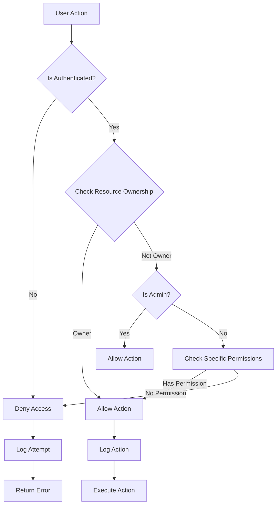

---

## 7. API Integration Patterns

### API Integration Architecture

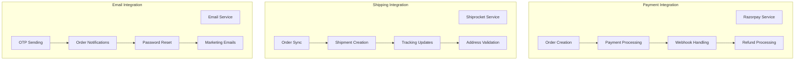

### Razorpay Integration
- **Order Creation:** Create Razorpay order before payment
- **Payment Processing:** Handle multiple payment methods
- **Webhook Verification:** Verify payment status via webhooks
- **Refund Processing:** Automated and manual refunds
- **Error Handling:** Graceful failure handling with order cancellation

### Payment Service Implementation

```javascript
// Razorpay Payment Service
export const processPayment = async (orderData, paymentMethod) => {
  try {
    // Create Razorpay order
    const razorpayOrder = await createRazorpayOrder({
      amount: orderData.total * 100, // Convert to paise
      currency: 'INR',
      receipt: orderData.id,
      notes: {
        orderId: orderData.id,
        userId: orderData.userId
      }
    });
    
    // Update order with Razorpay order ID
    await updateOrder(orderData.id, {
      razorpayOrderId: razorpayOrder.id,
      paymentStatus: 'pending'
    });
    
    // Return payment options
    return {
      orderId: razorpayOrder.id,
      amount: razorpayOrder.amount,
      currency: razorpayOrder.currency,
      key: process.env.RAZORPAY_KEY_ID,
      options: {
        method: paymentMethod,
        handler: async (response) => {
          // Verify payment signature
          const isValid = await verifyPaymentSignature(response);
          if (isValid) {
            await updateOrder(orderData.id, {
              paymentStatus: 'paid',
              paymentId: response.razorpay_payment_id,
              status: 'processing'
            });
            
            // Trigger order processing
            await processOrderAfterPayment(orderData.id);
          }
        }
      }
    };
  } catch (error) {
    console.error('Payment processing error:', error);
    throw new Error('Payment processing failed');
  }
};

// Webhook Handler
export const handleRazorpayWebhook = async (webhookData) => {
  const signature = webhookData.headers['x-razorpay-signature'];
  const isValid = verifyWebhookSignature(webhookData.body, signature);
  
  if (!isValid) {
    throw new Error('Invalid webhook signature');
  }
  
  const event = JSON.parse(webhookData.body);
  
  switch (event.event) {
    case 'payment.captured':
      await handlePaymentSuccess(event.payload.payment.entity);
      break;
    case 'payment.failed':
      await handlePaymentFailure(event.payload.payment.entity);
      break;
    case 'refund.processed':
      await handleRefundProcessed(event.payload.refund.entity);
      break;
  }
};
```

### Shiprocket Integration
- **Authentication:** OAuth2 token-based authentication
- **Order Sync:** Automatic order synchronization
- **Shipment Creation:** Bulk and individual shipment creation
- **Tracking:** Real-time tracking updates
- **Address Validation:** Pincode and address validation

---

## 8. Caching Strategy

### Cache Architecture

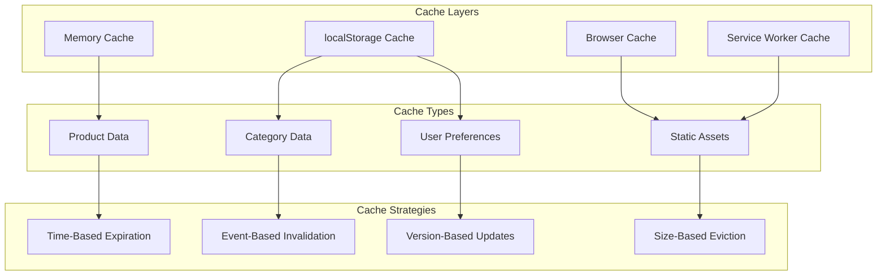

### Cache Implementation Details

#### Product Caching
- **Cache Duration:** 5 minutes for product lists
- **Invalidation:** On product updates, stock changes
- **Storage:** localStorage with compression
- **Strategy:** Cache-first with network fallback

#### Image Caching
- **Cache Duration:** 30 days for static images
- **Invalidation:** Version-based URL updates
- **Storage:** Service worker cache
- **Strategy:** Lazy loading with progressive enhancement

### Cache Utility Implementation

```javascript
// Advanced Cache Management
class CacheManager {
  constructor() {
    this.memoryCache = new Map();
    this.cacheConfig = {
      products: { ttl: 300000, maxSize: 50 }, // 5 minutes, 50 items
      categories: { ttl: 600000, maxSize: 20 }, // 10 minutes, 20 items
      user: { ttl: 900000, maxSize: 10 } // 15 minutes, 10 items
    };
  }
  
  // Set cache with TTL and size limits
  set(key, data, type = 'products') {
    const config = this.cacheConfig[type];
    if (!config) return false;
    
    // Check size limit
    if (this.memoryCache.size >= config.maxSize) {
      // Remove oldest item
      const firstKey = this.memoryCache.keys().next().value;
      this.memoryCache.delete(firstKey);
    }
    
    const cacheItem = {
      data,
      timestamp: Date.now(),
      ttl: config.ttl,
      type
    };
    
    this.memoryCache.set(key, cacheItem);
    
    // Also persist to localStorage for larger data
    if (type === 'products') {
      try {
        localStorage.setItem(`cache_${key}`, JSON.stringify(cacheItem));
      } catch (e) {
        console.warn('localStorage quota exceeded');
      }
    }
    
    return true;
  }
  
  // Get cache with expiration check
  get(key) {
    // Check memory cache first
    let cacheItem = this.memoryCache.get(key);
    
    if (!cacheItem) {
      // Fallback to localStorage
      try {
        const stored = localStorage.getItem(`cache_${key}`);
        if (stored) {
          cacheItem = JSON.parse(stored);
          // Restore to memory cache
          this.memoryCache.set(key, cacheItem);
        }
      } catch (e) {
        console.warn('Error reading from localStorage:', e);
      }
    }
    
    if (!cacheItem) return null;
    
    // Check expiration
    if (Date.now() - cacheItem.timestamp > cacheItem.ttl) {
      this.delete(key);
      return null;
    }
    
    return cacheItem.data;
  }
  
  // Delete cache from all layers
  delete(key) {
    this.memoryCache.delete(key);
    localStorage.removeItem(`cache_${key}`);
  }
  
  // Invalidate by pattern
  invalidatePattern(pattern) {
    const keys = Array.from(this.memoryCache.keys());
    keys.forEach(key => {
      if (key.includes(pattern)) {
        this.delete(key);
      }
    });
    
    // Clear localStorage items
    for (let i = 0; i < localStorage.length; i++) {
      const key = localStorage.key(i);
      if (key.startsWith('cache_') && key.includes(pattern)) {
        localStorage.removeItem(key);
      }
    }
  }
}

export const cacheManager = new CacheManager();
```

---

## 9. Error Handling Strategy

### Error Handling Flow

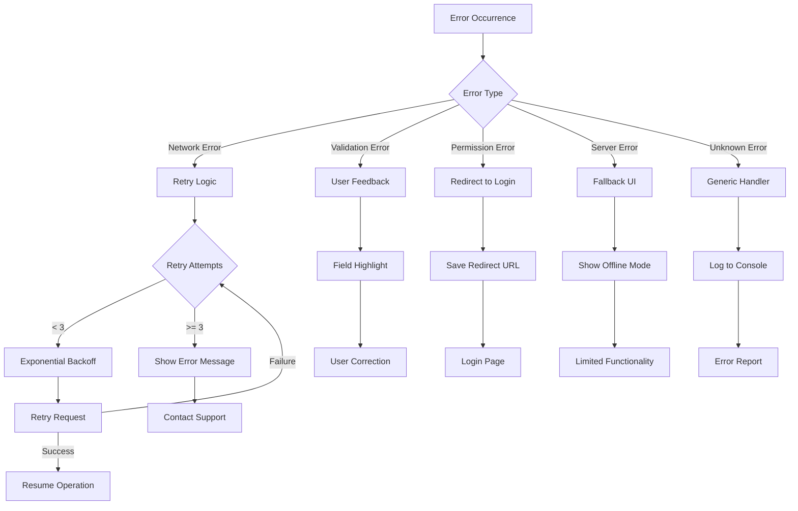

### Error Categories and Handling

#### Network Errors
- **Detection:** Fetch failures, timeout errors
- **Strategy:** Exponential backoff with 3 retry attempts
- **Fallback:** Show cached data if available
- **User Feedback:** "Connection lost, retrying..."

#### Validation Errors
- **Detection:** Form validation failures
- **Strategy:** Real-time field validation
- **Fallback:** Highlight invalid fields
- **User Feedback:** Specific error messages per field

#### Permission Errors
- **Detection:** 401/403 responses
- **Strategy:** Redirect to login with return URL
- **Fallback:** Show login modal
- **User Feedback:** "Please login to continue"

### Error Boundary Implementation

```javascript
// React Error Boundary
class ErrorBoundary extends React.Component {
  constructor(props) {
    super(props);
    this.state = { 
      hasError: false, 
      error: null, 
      errorInfo: null,
      retryCount: 0
    };
  }
  
  static getDerivedStateFromError(error) {
    return { hasError: true };
  }
  
  componentDidCatch(error, errorInfo) {
    this.setState({
      error,
      errorInfo
    });
    
    // Log error to monitoring service
    this.logError(error, errorInfo);
  }
  
  logError = (error, errorInfo) => {
    const errorData = {
      message: error.message,
      stack: error.stack,
      componentStack: errorInfo.componentStack,
      timestamp: new Date().toISOString(),
      userAgent: navigator.userAgent,
      url: window.location.href
    };
    
    // Send to error logging service
    console.error('Application Error:', errorData);
    
    // Could integrate with services like Sentry
    // Sentry.captureException(error, { extra: errorInfo });
  };
  
  handleRetry = () => {
    if (this.state.retryCount < 3) {
      this.setState(prevState => ({
        hasError: false,
        error: null,
        errorInfo: null,
        retryCount: prevState.retryCount + 1
      }));
    }
  };
  
  render() {
    if (this.state.hasError) {
      return (
        <div className="error-boundary">
          <h2>Something went wrong</h2>
          <p>We're sorry, but something unexpected happened.</p>
          
          {this.state.retryCount < 3 ? (
            <button onClick={this.handleRetry}>
              Try Again ({3 - this.state.retryCount} attempts left)
            </button>
          ) : (
            <div>
              <p>Please refresh the page or contact support if the problem persists.</p>
              <button onClick={() => window.location.reload()}>
                Refresh Page
              </button>
            </div>
          )}
          
          {process.env.NODE_ENV === 'development' && (
            <details style={{ marginTop: '20px' }}>
              <summary>Error Details</summary>
              <pre>{this.state.error && this.state.error.toString()}</pre>
              <pre>{this.state.errorInfo.componentStack}</pre>
            </details>
          )}
        </div>
      );
    }
    
    return this.props.children;
  }
}

// Global Error Handler
window.addEventListener('error', (event) => {
  console.error('Global Error:', event.error);
  // Handle unhandled errors
});

window.addEventListener('unhandledrejection', (event) => {
  console.error('Unhandled Promise Rejection:', event.reason);
  // Handle unhandled promise rejections
});
```

---

## Conclusion

This Low-Level Design document provides comprehensive implementation details for the HaathSaga e-commerce platform. The architecture emphasizes modularity, scalability, and maintainability through clear separation of concerns, robust error handling, and efficient caching strategies.

---

**Document Version:** 1.0  
**Last Updated:** January 2025  
**Author:** Architecture Team