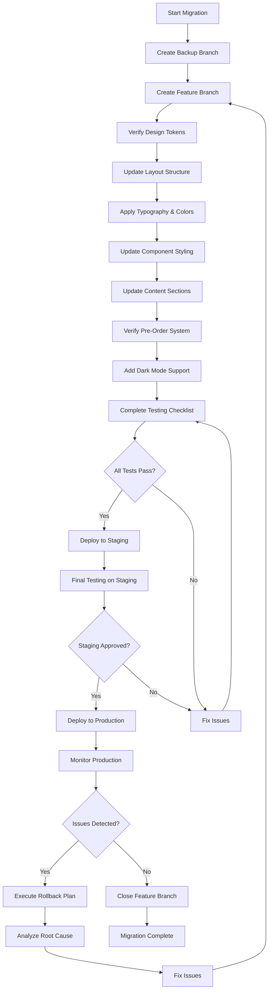

# Product Detail Page Design Migration Plan
## Transferring Clone's Design to Main Project's ProductDetailPage.jsx

**Project:** Haath Saga  
**Date:** 2026-01-03  
**Status:** Planning Phase  
**Target File:** [`pages/ProductDetailPage.jsx`](../pages/ProductDetailPage.jsx)  
**Source Reference:** [`Clone/pages/ProductDetail.tsx`](../Clone/pages/ProductDetail.tsx)

---

## Executive Summary

This migration plan outlines the systematic transfer of the clone's refined product page design to the main project's ProductDetailPage.jsx. The clone features a sophisticated color palette (indigo, terracotta, kora, gold), elegant typography (Playfair Display + Inter), and a 4:5 aspect ratio layout. The migration must preserve all existing functionality including pre-order system, wishlist management, cart integration, and dark mode support.

---

## 1. Design Element Mapping

### 1.1 Color Scheme Migration

| Clone Color | Hex Value | Current Usage | Target Usage |
|-------------|-----------|---------------|--------------|
| **indigo** | `#1F305E` | Primary text, headings, borders | Primary text, headings, borders |
| **indigo-dark** | `#162345` | Darker backgrounds, hover states | Darker backgrounds, hover states |
| **terracotta** | `#CC5500` | Accent, CTA buttons, hover states | Accent, CTA buttons, hover states |
| **terracotta-light** | `#E66100` | Lighter accent states | Lighter accent states |
| **kora** | `#F5F5DC` | Background, light surfaces | Background, light surfaces |
| **kora-dark** | `#EBEBD3` | Slightly darker backgrounds | Slightly darker backgrounds |
| **gold** | `#C5A059` | Decorative elements, highlights | Decorative elements, highlights |

**Status:** Colors already defined in [`tailwind.config.js`](../tailwind.config.js) and [`src/index.css`](../src/index.css) - no changes needed.

### 1.2 Typography Migration

| Element | Clone Font | Current Font | Implementation |
|---------|------------|--------------|----------------|
| Headings (h1, h2, h3) | Playfair Display | System fonts | Apply `font-serif` class |
| Body text | Inter | System fonts | Apply `font-sans` class |
| Product name | Playfair Display | System fonts | `font-serif text-3xl md:text-4xl` |
| Labels | Inter (uppercase) | System fonts | `font-sans text-sm uppercase tracking-wider` |
| Prices | Inter (bold) | System fonts | `font-sans font-bold` |

**Status:** Fonts already configured in [`tailwind.config.js`](../tailwind.config.js) - just need to apply classes.

### 1.3 Layout Structure Mapping

| Clone Element | Aspect Ratio | Current Implementation | Target Implementation |
|---------------|--------------|----------------------|----------------------|
| Main image container | 4:5 | aspect-square (1:1) | `aspect-[4/5]` |
| Thumbnail images | 1:1 | w-16 h-16 (1:1) | Keep 1:1 for thumbnails |
| Page padding | px-6 md:px-12 | px-4 py-12 | Update to match clone |
| Container max-width | max-w-[1440px] | container mx-auto | Update to max-w-[1440px] |
| Top padding | pt-32 | py-12 | Update to pt-32 |
| Bottom padding | pb-24 | py-12 | Update to pb-24 |
| Grid gap | gap-12 | gap-8 lg:gap-12 | Already matches |

### 1.4 Component Mapping

| Clone Component | Current Component | Changes Required |
|-----------------|-------------------|-------------------|
| Back link | None | Add "Back to Collections" link |
| Image gallery with navigation | Image gallery with navigation | Update styling, add drop badge |
| Thumbnail strip | Thumbnail strip | Update styling to match clone |
| Product name | Product name | Apply Playfair Display font |
| Price display | Price display | Update styling, add discount logic |
| Stock indicator | Stock indicator | Update to green badge style |
| Size selector | Size selector | Update button styling |
| Color selector | Color selector | Update button styling |
| Add to Cart button | Add to Cart button | Update to terracotta/indigo theme |
| Wishlist button | Wishlist button | Update to outlined style |
| Description | Description | Apply proper typography |
| Fabric details | Fabric details | Update layout and styling |
| Care instructions | None | Add care instructions section |
| Pre-order info | Pre-order info | Preserve functionality, update styling |

---

## 2. Step-by-Step Implementation Approach

### Phase 1: Preparation & Foundation (Priority: HIGH)

**Step 1.1: Verify Design Tokens**
- Confirm color palette in [`tailwind.config.js`](../tailwind.config.js:13-29)
- Verify font configuration in [`tailwind.config.js`](../tailwind.config.js:30-33)
- Ensure CSS variables in [`src/index.css`](../src/index.css:4-12) are correct
- **Risk:** Low - tokens already exist

**Step 1.2: Create Backup Branch**
```bash
git checkout -b backup/product-page-before-migration
git add .
git commit -m "Backup: ProductDetailPage before design migration"
```
- **Risk:** None - safety measure

**Step 1.3: Create Feature Branch**
```bash
git checkout -b feature/product-page-design-migration
```
- **Risk:** None - standard practice

### Phase 2: Layout Structure Updates (Priority: HIGH)

**Step 2.1: Update Container and Padding**
- Change outer container from `container mx-auto px-4 py-12` to `pt-32 pb-24 px-6 md:px-12 max-w-[1440px] mx-auto`
- Update grid gap from `gap-8 lg:gap-12` to `gap-12` (consistent)
- **Risk:** Medium - may affect responsive behavior
- **Mitigation:** Test on mobile, tablet, and desktop breakpoints

**Step 2.2: Update Image Gallery Aspect Ratio**
- Change main image from `aspect-square` to `aspect-[4/5]`
- Add `bg-kora-dark` background to image container
- Add `rounded-lg` class
- **Risk:** Medium - images may crop differently
- **Mitigation:** Test with various product images

**Step 2.3: Add Back to Collections Link**
- Insert back link before main content
- Use ArrowLeft icon from lucide-react
- Style with indigo color and hover effect
- **Risk:** Low - purely additive

### Phase 3: Typography & Color Updates (Priority: HIGH)

**Step 3.1: Apply Typography Classes**
- Product name: Add `font-serif` class
- Section headings: Add `font-serif` class
- Labels: Add `uppercase tracking-wider` classes
- Body text: Ensure `font-sans` is applied
- **Risk:** Low - visual changes only

**Step 3.2: Update Color Scheme**
- Replace generic colors with theme colors:
  - `text-gray-900` → `text-indigo`
  - `text-gray-600` → `text-indigo/70`
  - `bg-white` → `bg-kora` (where appropriate)
  - Border colors: `border-indigo/10` for subtle borders
- **Risk:** Medium - may affect contrast and accessibility
- **Mitigation:** Test with accessibility tools

### Phase 4: Component Styling Updates (Priority: HIGH)

**Step 4.1: Update Image Gallery Navigation**
- Style navigation buttons with `bg-kora/90 backdrop-blur-sm`
- Add hover effect: `hover:bg-terracotta hover:text-white`
- Add `shadow-lg` for depth
- **Risk:** Low - styling changes only

**Step 4.2: Update Thumbnail Strip**
- Change thumbnail styling to match clone
- Use `border-2` with conditional `border-terracotta` for active
- Add `hover:border-indigo/30` for hover state
- **Risk:** Low - styling changes only

**Step 4.3: Update Size Selector**
- Change size buttons to use indigo/terracotta theme
- Active state: `border-indigo bg-indigo text-kora`
- Inactive state: `border-indigo/20 text-indigo hover:border-indigo/50`
- Size: `w-12 h-12`
- **Risk:** Low - styling changes only

**Step 4.4: Update Color Selector**
- Keep circular buttons but update border colors
- Active state: `border-indigo scale-110`
- Inactive state: `border-indigo/20`
- Size: `w-10 h-10`
- **Risk:** Low - styling changes only

**Step 4.5: Update Action Buttons**
- Add to Cart button:
  - Default: `bg-indigo text-kora hover:bg-terracotta`
  - Pre-order: Use purple theme (preserve existing logic)
  - Disabled: `bg-gray-300 text-gray-500 cursor-not-allowed`
- Wishlist button:
  - Default: `border-indigo text-indigo hover:border-terracotta hover:text-terracotta`
  - Active: `border-terracotta bg-terracotta text-kora`
- **Risk:** Medium - affects user interaction
- **Mitigation:** Test all button states thoroughly

### Phase 5: Content Section Updates (Priority: MEDIUM)

**Step 5.1: Update Price Display**
- Apply clone styling:
  - Price: `text-3xl font-bold text-terracotta`
  - Original price: `text-lg text-indigo/40 line-through`
  - "Inclusive of all taxes": `text-sm text-indigo/60`
- **Risk:** Low - styling changes only

**Step 5.2: Update Stock Indicator**
- Change to green badge style:
  - Container: `inline-flex items-center gap-2 px-3 py-1 bg-green-50 border border-green-200 rounded`
  - Dot: `w-2 h-2 bg-green-500 rounded-full`
  - Text: `text-sm font-medium text-green-700`
- **Risk:** Low - styling changes only

**Step 5.3: Update Description Section**
- Apply proper typography:
  - Heading: `font-serif text-lg text-indigo mb-3`
  - Text: `text-indigo/70 leading-relaxed`
- **Risk:** Low - styling changes only

**Step 5.4: Update Fabric Details Section**
- Reorganize as key-value pairs:
  - Use flex layout with `justify-between`
  - Label: `text-sm text-indigo/60`
  - Value: `text-sm font-medium text-indigo`
- **Risk:** Low - styling changes only

**Step 5.5: Add Care Instructions Section**
- Create new section with clone styling:
  - Heading: `font-serif text-lg text-indigo mb-3`
  - List: `space-y-2 text-sm text-indigo/70`
- **Risk:** Low - additive feature

### Phase 6: Pre-Order System Preservation (Priority: CRITICAL)

**Step 6.1: Preserve Pre-Order Logic**
- Keep all existing pre-order state management
- Maintain validation logic
- Preserve modal functionality
- **Risk:** CRITICAL - breaking pre-order would be a major issue
- **Mitigation:** Do not modify logic, only update styling

**Step 6.2: Update Pre-Order Styling**
- Apply theme colors to pre-order sections
- Use purple theme for pre-order specific elements (existing pattern)
- Maintain visual distinction between regular and pre-order
- **Risk:** Medium - styling only, but must preserve functionality
- **Mitigation:** Test pre-order flow end-to-end

### Phase 7: Dark Mode Support (Priority: HIGH)

**Step 7.1: Update Dark Mode Classes**
- Ensure all color classes have dark mode variants
- Test all components in dark mode
- Maintain contrast ratios
- **Risk:** Medium - dark mode may break with new colors
- **Mitigation:** Comprehensive dark mode testing

### Phase 8: Responsive Design Verification (Priority: HIGH)

**Step 8.1: Test Mobile (< 768px)**
- Verify layout stacks correctly
- Check touch targets are adequate (min 44px)
- Ensure text is readable
- Test image gallery navigation
- **Risk:** Medium - new aspect ratio may affect mobile

**Step 8.2: Test Tablet (768px - 1024px)**
- Verify grid layout
- Check padding and spacing
- Test interactive elements
- **Risk:** Low - medium breakpoint usually works well

**Step 8.3: Test Desktop (> 1024px)**
- Verify max-width constraint
- Check hover states
- Test full functionality
- **Risk:** Low - desktop is primary target

### Phase 9: Testing & Quality Assurance (Priority: CRITICAL)

**Step 9.1: Functional Testing**
- Test add to cart
- Test wishlist toggle
- Test pre-order flow
- Test size/color selection
- Test image navigation
- **Risk:** Low - if implemented correctly

**Step 9.2: Visual Regression Testing**
- Compare with clone design
- Check all states (hover, active, disabled)
- Verify spacing and alignment
- **Risk:** Low - visual comparison

**Step 9.3: Cross-Browser Testing**
- Test in Chrome, Firefox, Safari, Edge
- Check for rendering issues
- **Risk:** Low - modern browsers handle Tailwind well

### Phase 10: Documentation & Deployment (Priority: MEDIUM)

**Step 10.1: Update Documentation**
- Document any breaking changes
- Update component props if needed
- Add migration notes to CHANGELOG
- **Risk:** None

**Step 10.2: Deploy to Staging**
- Deploy to staging environment
- Conduct final testing
- Get stakeholder approval
- **Risk:** Medium - staging issues possible
- **Mitigation:** Thorough testing before deployment

**Step 10.3: Production Deployment**
- Deploy to production
- Monitor for issues
- Be ready to rollback if needed
- **Risk:** Medium - production issues possible
- **Mitigation:** Have rollback plan ready

---

## 3. Risk Assessment & Mitigation Strategies

### 3.1 High-Risk Items

| Risk | Impact | Probability | Mitigation Strategy |
|------|--------|-------------|---------------------|
| Breaking pre-order functionality | CRITICAL | Low | Do not modify pre-order logic, only styling. Test pre-order flow thoroughly. |
| Dark mode compatibility issues | HIGH | Medium | Add dark mode variants to all color classes. Test extensively in dark mode. |
| Responsive layout breaking | HIGH | Medium | Test on all breakpoints. Use responsive classes appropriately. |
| Image cropping issues with 4:5 ratio | HIGH | Medium | Test with various product images. Consider adding object-fit options. |

### 3.2 Medium-Risk Items

| Risk | Impact | Probability | Mitigation Strategy |
|------|--------|-------------|---------------------|
| Contrast ratio issues | MEDIUM | Medium | Test with accessibility tools. Adjust colors if needed. |
| Button interaction issues | MEDIUM | Low | Test all button states. Ensure proper hover/active feedback. |
| Typography rendering issues | MEDIUM | Low | Ensure fonts are loaded. Test with different font weights. |
| Cross-browser compatibility | MEDIUM | Low | Test in all major browsers. Use standard Tailwind classes. |

### 3.3 Low-Risk Items

| Risk | Impact | Probability | Mitigation Strategy |
|------|--------|-------------|---------------------|
| Visual inconsistencies | LOW | Medium | Compare with clone design pixel-by-pixel. |
| Spacing issues | LOW | Low | Use Tailwind's spacing scale consistently. |
| Icon alignment issues | LOW | Low | Use flexbox for alignment. Test with different icon sizes. |

---

## 4. Testing Checklist

### 4.1 Functional Testing

- [ ] Add to cart works for in-stock products
- [ ] Add to cart works for pre-order products
- [ ] Wishlist toggle adds item to wishlist
- [ ] Wishlist toggle removes item from wishlist
- [ ] Size selection updates selected size
- [ ] Color selection updates selected color
- [ ] Image navigation works (next/previous)
- [ ] Thumbnail selection updates main image
- [ ] Pre-order terms acceptance works
- [ ] Pre-order modal displays correctly
- [ ] Pre-order confirmation works
- [ ] Toast notifications display correctly
- [ ] Back to collections link works

### 4.2 Visual Testing

- [ ] Product name uses Playfair Display font
- [ ] All headings use Playfair Display font
- [ ] Body text uses Inter font
- [ ] Color scheme matches clone (indigo, terracotta, kora, gold)
- [ ] Main image has 4:5 aspect ratio
- [ ] Thumbnail styling matches clone
- [ ] Size buttons match clone styling
- [ ] Color buttons match clone styling
- [ ] Add to cart button styling matches clone
- [ ] Wishlist button styling matches clone
- [ ] Price display matches clone styling
- [ ] Stock indicator matches clone styling
- [ ] Description section styling matches clone
- [ ] Fabric details styling matches clone
- [ ] Care instructions styling matches clone
- [ ] Back link styling matches clone

### 4.3 Responsive Testing

#### Mobile (< 768px)
- [ ] Layout stacks vertically
- [ ] Images display correctly at 4:5 ratio
- [ ] Touch targets are adequate (min 44px)
- [ ] Text is readable
- [ ] Buttons are easily tappable
- [ ] Image navigation buttons are accessible
- [ ] Thumbnails are scrollable if needed
- [ ] No horizontal overflow

#### Tablet (768px - 1024px)
- [ ] Grid layout displays correctly
- [ ] Images display correctly
- [ ] Padding and spacing are appropriate
- [ ] Interactive elements work correctly
- [ ] Text is readable

#### Desktop (> 1024px)
- [ ] Max-width constraint works (1440px)
- [ ] Grid layout displays correctly
- [ ] Hover states work properly
- [ ] All functionality works
- [ ] Spacing is consistent

### 4.4 Dark Mode Testing

- [ ] All text is readable in dark mode
- [ ] Background colors are appropriate
- [ ] Borders are visible
- [ ] Buttons work correctly
- [ ] Images display correctly
- [ ] Contrast ratios meet WCAG standards
- [ ] No color conflicts

### 4.5 Cross-Browser Testing

- [ ] Works in Chrome
- [ ] Works in Firefox
- [ ] Works in Safari
- [ ] Works in Edge
- [ ] No console errors
- [ ] No rendering issues

### 4.6 Accessibility Testing

- [ ] All images have alt text
- [ ] All buttons have accessible labels
- [ ] Keyboard navigation works
- [ ] Focus states are visible
- [ ] Contrast ratios meet WCAG AA standards
- [ ] Screen reader compatibility
- [ ] ARIA labels are appropriate

### 4.7 Pre-Order System Testing

- [ ] Pre-order availability check works
- [ ] Pre-order pricing displays correctly
- [ ] Pre-order stock validation works
- [ ] Pre-order limit check works
- [ ] Pre-order terms checkbox works
- [ ] Pre-order modal displays correctly
- [ ] Pre-order confirmation adds to cart
- [ ] Pre-order items marked correctly in cart
- [ ] Pre-order flow works end-to-end

### 4.8 Integration Testing

- [ ] Cart integration works
- [ ] Wishlist integration works
- [ ] User authentication works with wishlist
- [ ] Guest wishlist syncs to user wishlist
- [ ] Product data loads correctly
- [ ] Images load correctly
- [ ] Error handling works

---

## 5. Rollback Plan

### 5.1 Rollback Triggers

Rollback should be initiated if:
- Critical functionality breaks (pre-order, cart, wishlist)
- Dark mode has severe issues
- Responsive layout breaks on any breakpoint
- Performance degrades significantly
- User reports critical issues
- Cross-browser compatibility issues

### 5.2 Rollback Procedure

**Immediate Rollback (Critical Issues)**
```bash
# 1. Revert to backup branch
git checkout backup/product-page-before-migration

# 2. Force push to main (if already deployed)
git push origin main --force

# 3. Clear cache if needed
# Clear CDN cache, browser cache, etc.
```

**Gradual Rollback (Non-Critical Issues)**
```bash
# 1. Identify problematic changes
git diff backup/product-page-before-migration feature/product-page-design-migration

# 2. Revert specific commits if needed
git revert <commit-hash>

# 3. Test after each revert
# Run test suite, manual testing

# 4. Deploy fixes
```

### 5.3 Rollback Verification

After rollback, verify:
- [ ] All functionality restored
- [ ] No new issues introduced
- [ ] Performance is acceptable
- [ ] User reports resolved
- [ ] Monitoring shows normal operation

### 5.4 Post-Rollback Analysis

Document:
- What caused the rollback
- What was the impact
- How to prevent recurrence
- Lessons learned

---

## 6. Code Examples for Key Design Elements

### 6.1 Container and Layout Structure

```jsx
// Clone's container structure
<div className="pt-32 pb-24 px-6 md:px-12 max-w-[1440px] mx-auto">
  {/* Back link */}
  <Link to="/collections" className="inline-flex items-center gap-2 text-sm text-indigo/60 hover:text-terracotta transition-colors mb-8">
    <ArrowLeft className="w-4 h-4" />
    Back to Collections
  </Link>

  {/* Main grid */}
  <div className="grid grid-cols-1 lg:grid-cols-2 gap-12">
    {/* Left column - Images */}
    {/* Right column - Details */}
  </div>
</div>
```

### 6.2 Image Gallery with 4:5 Aspect Ratio

```jsx
// Main image container
<div className="relative aspect-[4/5] bg-kora-dark overflow-hidden rounded-lg">
  

  {/* Navigation buttons */}
  {product.images.length > 1 && (
    <>
      <button
        onClick={prevImage}
        className="absolute left-4 top-1/2 -translate-y-1/2 w-10 h-10 bg-kora/90 backdrop-blur-sm rounded-full flex items-center justify-center text-indigo hover:bg-terracotta hover:text-white transition-all shadow-lg"
      >
        <ChevronLeft className="w-5 h-5" />
      </button>
      <button
        onClick={nextImage}
        className="absolute right-4 top-1/2 -translate-y-1/2 w-10 h-10 bg-kora/90 backdrop-blur-sm rounded-full flex items-center justify-center text-indigo hover:bg-terracotta hover:text-white transition-all shadow-lg"
      >
        <ChevronRight className="w-5 h-5" />
      </button>
    </>
  )}

  {/* Drop badge */}
  <div className="absolute top-4 left-4">
    <span className="bg-kora/90 backdrop-blur-md text-[8px] uppercase tracking-widest px-3 py-1 text-indigo font-bold border border-indigo/10">
      {product.drop}
    </span>
  </div>
</div>
```

### 6.3 Thumbnail Strip

```jsx
{/* Thumbnail Images */}
{product.images.length > 1 && (
  <div className="flex gap-3">
    {product.images.map((image, index) => (
      <button
        key={index}
        onClick={() => setCurrentImageIndex(index)}
        className={`flex-1 aspect-square rounded overflow-hidden border-2 transition-all ${
          currentImageIndex === index
            ? 'border-terracotta'
            : 'border-indigo/10 hover:border-indigo/30'
        }`}
      >
        
      </button>
    ))}
  </div>
)}
```

### 6.4 Product Name and Price

```jsx
<div>
  <h1 className="font-serif text-3xl md:text-4xl text-indigo mb-3">
    {product.name}
  </h1>

  <div className="flex items-baseline gap-3 mb-4">
    <span className="text-3xl font-bold text-terracotta">
      ₹{product.price.toLocaleString()}
    </span>
    {product.originalPrice && (
      <span className="text-lg text-indigo/40 line-through">
        ₹{product.originalPrice.toLocaleString()}
      </span>
    )}
  </div>

  <p className="text-sm text-indigo/60 mb-2">Inclusive of all taxes</p>

  {/* Stock indicator */}
  <div className="inline-flex items-center gap-2 px-3 py-1 bg-green-50 border border-green-200 rounded">
    <div className="w-2 h-2 bg-green-500 rounded-full"></div>
    <span className="text-sm font-medium text-green-700">In Stock</span>
  </div>
</div>
```

### 6.5 Size Selector

```jsx
<div>
  <h3 className="text-sm font-semibold text-indigo mb-3 uppercase tracking-wider">
    Select Size
  </h3>
  <div className="flex gap-3">
    {sizes.map((size) => (
      <button
        key={size}
        onClick={() => setSelectedSize(size)}
        className={`w-12 h-12 rounded border-2 font-medium text-sm transition-all ${
          selectedSize === size
            ? 'border-indigo bg-indigo text-kora'
            : 'border-indigo/20 text-indigo hover:border-indigo/50'
        }`}
      >
        {size}
      </button>
    ))}
  </div>
</div>
```

### 6.6 Color Selector

```jsx
<div>
  <h3 className="text-sm font-semibold text-indigo mb-3 uppercase tracking-wider">
    Select Color
  </h3>
  <div className="flex gap-3">
    {colors.map((color) => (
      <button
        key={color}
        onClick={() => setSelectedColor(color)}
        className={`w-10 h-10 rounded-full border-2 transition-all ${
          selectedColor === color
            ? 'border-indigo scale-110'
            : 'border-indigo/20'
        }`}
        style={{ backgroundColor: color.toLowerCase().replace(' ', '') }}
        title={color}
      >
        {selectedColor === color && (
          <Check size={16} className={color.toLowerCase() === 'white' ? 'text-black' : 'text-white'} />
        )}
      </button>
    ))}
  </div>
</div>
```

### 6.7 Action Buttons

```jsx
<div className="flex gap-4">
  {/* Add to Cart Button */}
  <button
    onClick={handleAddToCart}
    className={`flex-1 py-4 rounded font-medium text-sm uppercase tracking-widest transition-all flex items-center justify-center gap-2 ${
      isAddingToCart
        ? 'bg-terracotta text-kora'
        : 'bg-indigo text-kora hover:bg-terracotta'
    }`}
  >
    <ShoppingBag className="w-5 h-5" />
    Add to Cart
  </button>

  {/* Wishlist Button */}
  <button
    onClick={handleAddToWishlist}
    className={`px-6 py-4 rounded border-2 transition-all ${
      isAddingToWishlist
        ? 'border-terracotta bg-terracotta text-kora'
        : 'border-indigo text-indigo hover:border-terracotta hover:text-terracotta'
    }`}
  >
    <Heart className={`w-5 h-5 ${isAddingToWishlist ? 'fill-current' : ''}`} />
  </button>
</div>
```

### 6.8 Description Section

```jsx
<div className="pt-6 border-t border-indigo/10">
  <h3 className="font-serif text-lg text-indigo mb-3">Description</h3>
  <p className="text-indigo/70 leading-relaxed mb-4">
    {product.description}
  </p>
  {product.story && (
    <p className="text-indigo/70 leading-relaxed italic">
      {product.story}
    </p>
  )}
</div>
```

### 6.9 Fabric Details Section

```jsx
<div className="pt-6 border-t border-indigo/10">
  <h3 className="font-serif text-lg text-indigo mb-4">Fabric Details</h3>
  <div className="space-y-3">
    <div className="flex justify-between">
      <span className="text-sm text-indigo/60">Fabric:</span>
      <span className="text-sm font-medium text-indigo">{product.fabric}</span>
    </div>
    <div className="flex justify-between">
      <span className="text-sm text-indigo/60">Dye:</span>
      <span className="text-sm font-medium text-indigo">{product.dye}</span>
    </div>
    <div className="flex justify-between">
      <span className="text-sm text-indigo/60">Occasion:</span>
      <span className="text-sm font-medium text-indigo">{product.occasion}</span>
    </div>
    <div className="flex justify-between">
      <span className="text-sm text-indigo/60">Collection:</span>
      <span className="text-sm font-medium text-indigo">{product.drop}</span>
    </div>
  </div>
</div>
```

### 6.10 Care Instructions Section

```jsx
<div className="pt-6 border-t border-indigo/10">
  <h3 className="font-serif text-lg text-indigo mb-3">Care Instructions</h3>
  <ul className="space-y-2 text-sm text-indigo/70">
    <li>• Dry clean only for best results</li>
    <li>• Hand wash in cold water if necessary</li>
    <li>• Do not bleach or wring</li>
    <li>• Iron on low heat while slightly damp</li>
    <li>• Store in a cool, dry place</li>
  </ul>
</div>
```

### 6.11 Dark Mode Variants

```jsx
// Example of adding dark mode support
<div className="bg-kora dark:bg-gray-900 text-indigo dark:text-gray-100">
  {/* Content */}
</div>

// Button with dark mode
<button className="bg-indigo text-kora hover:bg-terracotta dark:bg-indigo-dark dark:text-kora dark:hover:bg-terracotta-light">
  Add to Cart
</button>

// Border with dark mode
<div className="border border-indigo/10 dark:border-indigo/30">
  {/* Content */}
</div>
```

---

## 7. Files to Modify

### Primary Files

1. **[`pages/ProductDetailPage.jsx`](../pages/ProductDetailPage.jsx)**
   - Main file to migrate
   - All design changes will be applied here
   - **Priority:** CRITICAL

2. **[`tailwind.config.js`](../tailwind.config.js)**
   - Verify color palette configuration
   - Verify font configuration
   - **Priority:** LOW (likely no changes needed)

3. **[`src/index.css`](../src/index.css)**
   - Verify CSS variables
   - May need to add utility classes
   - **Priority:** LOW

### Secondary Files (Potential Updates)

4. **[`types.js`](../types.js)**
   - May need to add care instructions field
   - **Priority:** LOW

5. **[`constants.js`](../constants.js)**
   - May need to add care instructions constants
   - **Priority:** LOW

### Files to Review (No Changes Expected)

6. **[`src/contexts/CartContext.jsx`](../src/contexts/CartContext.jsx)** - Review only
7. **[`src/hooks/useCart.js`](../src/hooks/useCart.js)** - Review only
8. **[`src/hooks/useWishlist.js`](../src/hooks/useWishlist.js)** - Review only
9. **[`src/firebase/services/productService.js`](../src/firebase/services/productService.js)** - Review only

---

## 8. Prioritized Task List for Implementation

### Priority 1: Critical Foundation (Must Complete First)

- [ ] **TASK-001:** Create backup branch
- [ ] **TASK-002:** Create feature branch
- [ ] **TASK-003:** Verify design tokens in [`tailwind.config.js`](../tailwind.config.js)
- [ ] **TASK-004:** Verify CSS variables in [`src/index.css`](../src/index.css)
- [ ] **TASK-005:** Test existing functionality (pre-order, cart, wishlist)

### Priority 2: Layout Structure (High Priority)

- [ ] **TASK-006:** Update container and padding in [`ProductDetailPage.jsx`](../pages/ProductDetailPage.jsx)
- [ ] **TASK-007:** Update image gallery aspect ratio to 4:5
- [ ] **TASK-008:** Add back to collections link
- [ ] **TASK-009:** Test responsive layout on mobile

### Priority 3: Typography & Colors (High Priority)

- [ ] **TASK-010:** Apply Playfair Display font to headings
- [ ] **TASK-011:** Apply Inter font to body text
- [ ] **TASK-012:** Update color scheme to use theme colors
- [ ] **TASK-013:** Test contrast ratios

### Priority 4: Component Styling (High Priority)

- [ ] **TASK-014:** Update image gallery navigation styling
- [ ] **TASK-015:** Update thumbnail strip styling
- [ ] **TASK-016:** Update size selector styling
- [ ] **TASK-017:** Update color selector styling
- [ ] **TASK-018:** Update action buttons styling
- [ ] **TASK-019:** Test all interactive elements

### Priority 5: Content Sections (Medium Priority)

- [ ] **TASK-020:** Update price display styling
- [ ] **TASK-021:** Update stock indicator styling
- [ ] **TASK-022:** Update description section styling
- [ ] **TASK-023:** Update fabric details section styling
- [ ] **TASK-024:** Add care instructions section

### Priority 6: Pre-Order System (Critical Priority)

- [ ] **TASK-025:** Verify pre-order logic is unchanged
- [ ] **TASK-026:** Update pre-order styling only
- [ ] **TASK-027:** Test pre-order flow end-to-end

### Priority 7: Dark Mode Support (High Priority)

- [ ] **TASK-028:** Add dark mode variants to all color classes
- [ ] **TASK-029:** Test dark mode on all components
- [ ] **TASK-030:** Verify contrast ratios in dark mode

### Priority 8: Testing & QA (Critical Priority)

- [ ] **TASK-031:** Complete functional testing checklist
- [ ] **TASK-032:** Complete visual testing checklist
- [ ] **TASK-033:** Complete responsive testing checklist
- [ ] **TASK-034:** Complete dark mode testing checklist
- [ ] **TASK-035:** Complete cross-browser testing checklist
- [ ] **TASK-036:** Complete accessibility testing checklist
- [ ] **TASK-037:** Complete pre-order system testing checklist
- [ ] **TASK-038:** Complete integration testing checklist

### Priority 9: Documentation & Deployment (Medium Priority)

- [ ] **TASK-039:** Document any breaking changes
- [ ] **TASK-040:** Update component documentation
- [ ] **TASK-041:** Add migration notes to CHANGELOG
- [ ] **TASK-042:** Deploy to staging environment
- [ ] **TASK-043:** Conduct final testing on staging
- [ ] **TASK-044:** Get stakeholder approval
- [ ] **TASK-045:** Deploy to production
- [ ] **TASK-046:** Monitor for issues
- [ ] **TASK-047:** Close feature branch

---

## 9. Implementation Workflow Diagram



---

## 10. Success Criteria

The migration will be considered successful when:

1. **Visual Fidelity**
   - [ ] Design matches clone's visual appearance
   - [ ] Color scheme is consistent (indigo, terracotta, kora, gold)
   - [ ] Typography matches clone (Playfair Display + Inter)
   - [ ] Layout structure matches clone (4:5 aspect ratio, spacing)

2. **Functionality Preservation**
   - [ ] All existing features work correctly
   - [ ] Pre-order system functions properly
   - [ ] Cart integration works
   - [ ] Wishlist integration works
   - [ ] User authentication works

3. **Responsive Design**
   - [ ] Works correctly on mobile (< 768px)
   - [ ] Works correctly on tablet (768px - 1024px)
   - [ ] Works correctly on desktop (> 1024px)

4. **Dark Mode Support**
   - [ ] All components work in dark mode
   - [ ] Contrast ratios meet WCAG standards
   - [ ] No visual issues in dark mode

5. **Cross-Browser Compatibility**
   - [ ] Works in Chrome, Firefox, Safari, Edge
   - [ ] No rendering issues
   - [ ] No console errors

6. **Accessibility**
   - [ ] All images have alt text
   - [ ] All buttons have accessible labels
   - [ ] Keyboard navigation works
   - [ ] Screen reader compatibility
   - [ ] WCAG AA compliance

7. **Performance**
   - [ ] No performance degradation
   - [ ] Load times acceptable
   - [ ] No memory leaks

8. **User Acceptance**
   - [ ] Stakeholder approval obtained
   - [ ] No critical user issues reported
   - [ ] Positive feedback on design changes

---

## 11. Post-Migration Tasks

After successful migration:

1. **Documentation Updates**
   - Update component documentation
   - Update design system documentation
   - Create migration guide for other pages

2. **Code Cleanup**
   - Remove any temporary code
   - Optimize imports
   - Remove unused variables

3. **Performance Optimization**
   - Profile page performance
   - Optimize image loading
   - Minimize re-renders

4. **Future Enhancements**
   - Consider adding image zoom feature
   - Consider adding 360-degree product view
   - Consider adding video support

5. **Knowledge Sharing**
   - Share lessons learned with team
   - Document best practices
   - Create reusable components

---

## 12. Conclusion

This migration plan provides a comprehensive roadmap for transferring the clone's refined product page design to the main project while preserving all critical functionality. The plan includes:

- Detailed design element mapping
- Step-by-step implementation approach
- Risk assessment and mitigation strategies
- Comprehensive testing checklist
- Rollback plan for emergencies
- Code examples for key elements
- Complete file modification list
- Prioritized task list

The migration is structured to minimize risk while ensuring a successful outcome. By following this plan systematically, the team can achieve the desired design upgrade without breaking existing functionality.

**Next Steps:**
1. Review this plan with stakeholders
2. Get approval to proceed
3. Switch to Code mode to begin implementation
4. Follow the prioritized task list
5. Complete testing before deployment

---

**Document Version:** 1.0  
**Last Updated:** 2026-01-03  
**Author:** Architect Mode  
**Status:** Ready for Review
